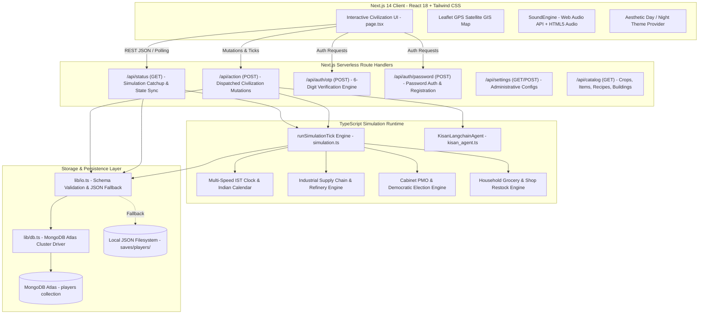

# 🏗️ AI Civilization Simulator — System Design & Architecture Specification

This document provides a comprehensive technical breakdown of the architecture, data models, simulation algorithms, API contracts, security models, and storage layer for the **Navsari AI Civilization Simulator**.

---

## 1. High-Level System Architecture



---

## 2. Core Data Models (`lib/simulation.ts`)

### 2.1. `PlayerState` Interface
The single source of truth for an entire civilization / citizen instance:

```typescript
export interface PlayerState {
  user_id: string;                      // Unique email or username identifier
  password_hash?: string;               // SHA-256 hashed password credentials
  money: number;                        // Player brokerage liquid currency ($)
  inventory: Record<string, number>;    // Item IDs -> Quantities in player bag
  clock: {
    total_seconds: number;              // Continuous cumulative simulation seconds
    speed: number;                      // Time speed multiplier (1, 10, 60, 1000)
    weather: string;                    // Current meteorological weather condition
    formatted?: string;                 // e.g. "Day 14 • 17:30 hrs (IST)"
  };
  plots: FarmPlot[];                    // 12 Agricultural cultivation plots
  buildings: PlacedBuilding[];          // Placed spatial city structures
  craft_job: CraftJob | null;           // Active workshop crafting job
  plot_count: number;                   // Number of unlocked plots
  owned_land: number[][];               // Unlocked geographical grid matrix
  camera_x: number;
  camera_y: number;
  build_queue: BuildJob[];              // Ongoing municipal construction jobs
  agent_settings: any;
  agent_logs: string[];                 // Rolling administrative telemetry log
  item_prices: Record<string, number>;  // Dynamic commodity exchange prices
  last_price_update_day: number;        // Day index of last market fluctuation
  
  // Micro-Nation Civic & Household Fields
  city_name: string;                    // e.g. "Navsari Micro-Nation Colony"
  city_treasury: number;                // Municipal treasury reserves ($)
  tax_rate: number;                     // Corporate colony tax rate (%)
  city_projects: {                      // Civic infrastructure investments
    id: string;
    name: string;
    cost: number;
    allocated: number;
    completed: boolean;
  }[];
  household: {                          // Primary household
    name: string;
    budget: number;
    inventory: Record<string, number>;
    members: FamilyMember[];
  };
  shops: {                              // Commercial retail stores
    id: string;                         // e.g. "farmers_market", "dairy", "general"
    name: string;
    owner: string;
    inventory: Record<string, number>;
    prices: Record<string, number>;
    revenue: number;
    sales_history: string[];
  }[];
  families: {                           // All residential households & hostels
    id: string;                         // e.g. "house_1", "house_2", "worker_hostel_1"
    name: string;
    address?: string;
    type?: "house" | "hostel";
    capacity?: number;
    budget: number;
    inventory: Record<string, number>;
    members: FamilyMember[];
  }[];
  government: {                         // Democratic fiscal & welfare policy
    mayor: string;
    income_tax: number;
    sales_tax: number;
    welfare_threshold: number;
    welfare_payout: number;
    welfare_checks_payouts: number;
  };
  cabinet: {                            // Executive Council Ministers
    prime_minister: string;
    district_magistrate: string;
    ministers: Record<string, string>;
  };
  news_feed: {                          // Real-time live headline ticker
    timestamp: string;
    headline: string;
    category: "POLITICS" | "ECONOMY" | "LOCAL" | "WEATHER";
  }[];
  livestock?: {                         // Farm livestock population
    cows: number;
    sheep: number;
    chickens: number;
    last_produce_day?: number;
  };
  farm_barn?: Record<string, number>;   // Central agricultural produce silo
  automated_farming_enabled?: boolean;
  city_manager_enabled: boolean;
  zone_locations: Record<string, [number, number]>; // GPS Coordinates
  
  // Industrial Sector Fields
  industry?: {
    oil_refinery: {
      crude_oil: number;
      refined_petrol: number;
      diesel: number;
      marine_fuel: number;
      is_active: boolean;
      efficiency: number;
    };
    petrol_pump: {
      fuel_stock: number;
      diesel_stock: number;
      price_per_liter: number;
      daily_sales_liters: number;
      revenue: number;
      ev_charging_active: boolean;
      recent_refuelings?: {
        citizen: string;
        vehicle: string;
        liters: number;
        cost: number;
        fuel_type: string;
        time: string;
      }[];
    };
    shipyard: {
      ships_docked: number;
      ships_under_construction: number;
      fleet: {
        id: string;
        name: string;
        type: "cargo_ship" | "passenger_ferry" | "fishing_trawler";
        fuel: number;
        status: string;
      }[];
    };
    heavy_manufacturing: {
      iron_ore_stock: number;
      steel_beams: number;
      concrete_stock: number;
      active_smelters: number;
    };
  };
}
```

---

## 3. Mathematical Models & Simulation Mechanics

### 3.1. Clock Math & Calendar Conversion
$$\text{In-Game Day} = \left\lfloor \frac{\text{total\_seconds}}{1440} \right\rfloor + 1$$
$$\text{Hour of Day (IST)} = \left\lfloor \frac{\text{total\_seconds} \pmod{1440}}{60} \right\rfloor$$
$$\text{Minute of Hour} = \lfloor \text{total\_seconds} \pmod{60} \rfloor$$

### 3.2. Dynamic Crop Maturation
Crop progress is evaluated instantaneously against simulation elapsed time:
$$\text{Elapsed Time} = \max(\text{RealElapsed}, \text{total\_seconds} - \text{planted\_game\_seconds})$$
$$\text{Progress \%} = \min\left(100, \left\lfloor \frac{\text{Elapsed Time}}{\text{growth\_seconds}} \times 100 \right\rfloor \right)$$
$$\text{Remaining Seconds} = \max(0, \text{growth\_seconds} - \text{Elapsed Time})$$

When running at **10× speed**, $\Delta \text{total\_seconds}$ advances at $10\times$, reducing a $20\text{s}$ growth cycle to $2\text{s}$ of wall-clock time.

---

## 4. API Endpoints Specification

### 4.1. `GET /api/status`
- **Query Params**: `user_id` (string)
- **Execution**: Computes catchup ticks since `last_saved_at` scaled by `player.clock.speed`.
- **Response**:
  ```json
  {
    "ok": true,
    "user_id": "vandan_11",
    "is_admin": true,
    "money": 1250,
    "clock": {
      "day": 5,
      "hour": 17,
      "minute": 30,
      "total_seconds": 6810,
      "formatted": "Day 5 • 17:30 hrs (IST)",
      "indian_date": "05/01/2026",
      "is_night": false,
      "weather": "Clear",
      "speed": 10,
      "paused": false
    },
    "plots": [...],
    "news_feed": [...],
    "families": [...],
    "industry": {...}
  }
  ```

### 4.2. `POST /api/action`
- **Body**: `{ action: string, user_id: string, ...params }`
- **Supported Actions**:
  - `set_speed`: Sets simulation multiplier (`1, 10, 60, 1000`) and pause state.
  - `step_simulation`: Advances simulation by specified seconds.
  - `plant_plot` / `plant_all`: Cultivates selected crops.
  - `harvest_plot` / `harvest_all`: Harvests mature farm plots.
  - `buy_seeds`: Procures seeds from Kisan Agricultural Depot.
  - `refine_petrol`: Cracks crude oil into gasoline, diesel, and marine bunker.
  - `set_fuel_price`: Configures retail fuel price at Highway 48 Station.
  - `commission_ship` / `dispatch_ship_voyage`: Expands and deploys shipyard fleet.
  - `smelt_steel`: Casts structural steel beams from iron ore.
  - `create_residence` / `edit_residence` / `delete_residence`: Spatial housing management.
  - `edit_family_member` / `transfer_worker`: Citizen occupational assignments.
  - `run_kisan_agent` / `run_industrial_agent`: Dispatches autonomous AI cycles.

---

## 5. Security & Civic Privacy Architecture

1. **Role-Based Access Control (RBAC)**:
   - **Supreme Admin (`vandan11patel@gmail.com` / `vandan_11`)**: Full write and modify access to all civic finances, cabinet assignments, housing creation, livestock, and raw telemetry.
   - **Regular Citizens**: Full control over personal inventory and bag, but sensitive private financial data (other citizen household budgets, private family structures) is dynamically redacted by `/api/status`.
2. **Authentication Security**:
   - Secure one-time passwords (6-digit cryptographically random OTPs).
   - Rate-limited generation and verification.
   - Passwords hashed with SHA-256 before persistence.
