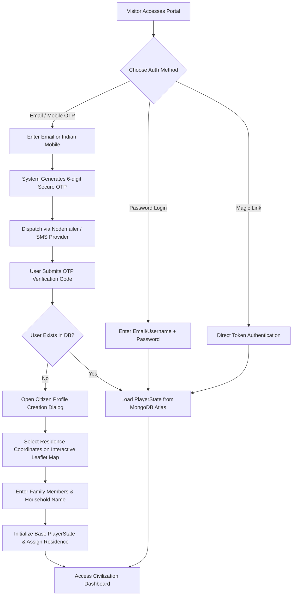
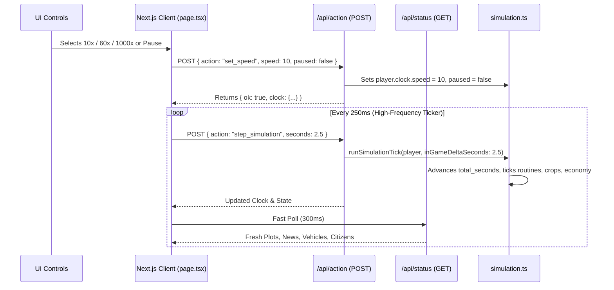
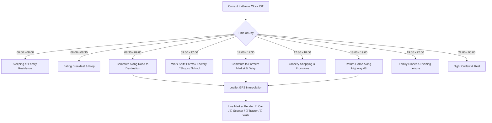
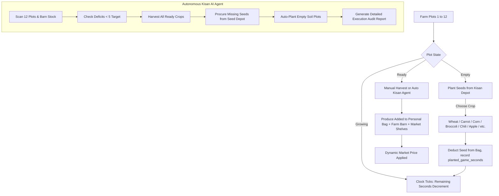
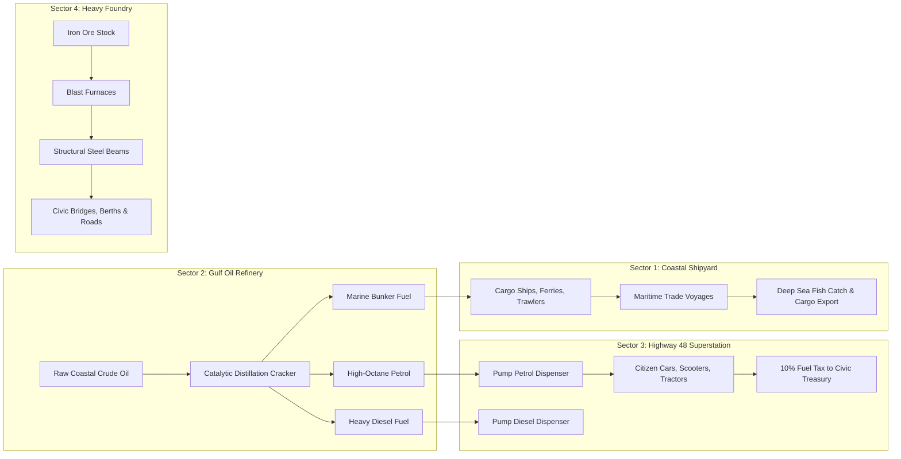
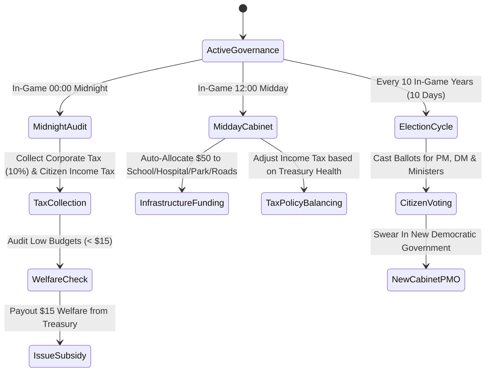
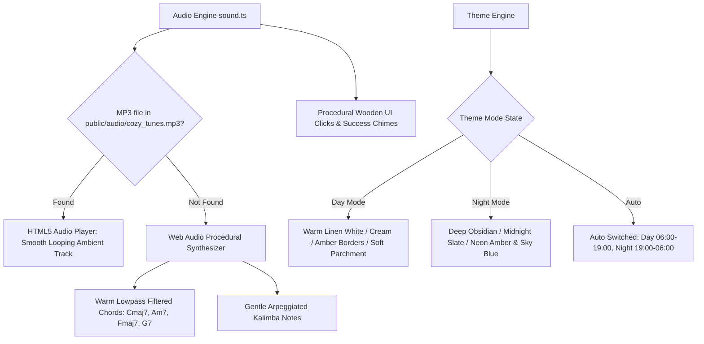

# 🔄 AI Civilization Simulator — Comprehensive Workflow Guide

This document outlines the end-to-end operational workflows for citizens, administrators, autonomous AI agents, and system sub-modules in the **Navsari AI Civilization Simulator**.

---

## Table of Contents
1. [Citizen Onboarding & Authentication Workflow](#1-citizen-onboarding--authentication-workflow)
2. [Simulation Timeline & Multi-Speed Clock Workflow](#2-simulation-timeline--multi-speed-clock-workflow)
3. [Geospatial City Map & Dynamic Commute Workflow](#3-geospatial-city-map--dynamic-commute-workflow)
4. [Agricultural Farming & Kisan AI Agent Workflow](#4-agricultural-farming--kisan-ai-agent-workflow)
5. [Industrial Revolution & Petroleum Supply Chain Workflow](#5-industrial-revolution--petroleum-supply-chain-workflow)
6. [Household Commerce, Grocery & Market Restock Workflow](#6-household-commerce-grocery--market-restock-workflow)
7. [Governance, Cabinet PMO & Democratic Election Workflow](#7-governance-cabinet-pmo--democratic-election-workflow)
8. [Master Resource Inventory & Census Monitoring Workflow](#8-master-resource-inventory--census-monitoring-workflow)
9. [Audio & Theme Customization Workflow](#9-audio--theme-customization-workflow)

---

## 1. Citizen Onboarding & Authentication Workflow

### Key Steps:
1. **Interactive Registration**: New citizens pick their exact residential plot on a live satellite GIS map centered in Navsari (`20.9467° N, 72.9520° E`).
2. **Role & Household Initialization**: Default family members are assigned occupations (Farmer, Merchant, Factory Worker, Engineer, Teacher, Doctor, Student).
3. **Session Persistence**: Authentication state is stored securely in `localStorage` (`civilization_active_user`) and synced with MongoDB Atlas.

---

## 2. Simulation Timeline & Multi-Speed Clock Workflow

### Time Mechanics:
- **1 In-Game Hour** = `60 seconds` (1 real minute at 1× speed).
- **1 In-Game Day** = `1440 seconds` (24 real minutes at 1× speed).
- **Speed Multipliers**:
  - `1×`: Real-time baseline.
  - `10×`: 1 in-game hour passes in **6 real seconds**.
  - `60×`: 1 in-game hour passes in **1 real second**.
  - `1000×`: Super Warp mode for rapid century/era simulations.

---

## 3. Geospatial City Map & Dynamic Commute Workflow

---

## 4. Agricultural Farming & Kisan AI Agent Workflow

---

## 5. Industrial Revolution & Petroleum Supply Chain Workflow

---

## 6. Household Commerce, Grocery & Market Restock Workflow

1. **Daily Wages Payout (17:00)**: Working citizens receive wages ($10 - $45/day) into their family household budget.
2. **Grocery Shopping (17:00 - 18:00)**:
   - Family heads visit **Farmers Market** & **Dairy Depot**.
   - Purchase fresh vegetables (Carrots, Broccoli, Cabbage, Corn, Wheat), Milk, and Eggs based on household member count.
   - Sales tax (5%) is collected directly into the **Civic Treasury**.
3. **Morning Merchant Restock (06:00)**:
   - Shopkeepers audit inventory shelves.
   - Buy bulk wholesale goods from Player Brokerage reserves, earning gold for the player.

---

## 7. Governance, Cabinet PMO & Democratic Election Workflow

---

## 8. Master Resource Inventory & Census Monitoring Workflow

- **Master Inventory Modal (`Ctrl+I` / Quick Pill)**:
  - Aggregates resource metrics across all 4 holding areas: **Barn/Silo**, **Warehouse**, **Market Shelves**, and **Family Pantries**.
  - Category filters: All, Crops & Grains, Livestock & Dairy, Textiles & Fiber, Heavy Materials & Fuels.
- **Master Citizen Census Modal**:
  - Lists all 7 core historical residences and custom worker hostels.
  - Search by citizen name, career, or residence.
  - Administrative actions: Edit Member Role, Change Vehicle, Build Residence, Transfer Citizen, Teleport Camera.

---

## 9. Audio & Theme Customization Workflow

